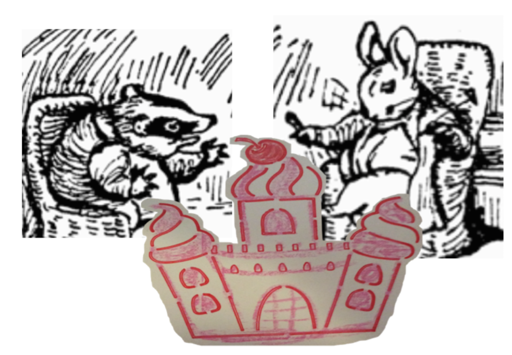

Etter at Geir Grevling og bestefar Benjamini Kanini har kooost seg med sjokoladekake og 4 store glass med Churchill's 20 år gamle lysebrune portvin må bestefar gjespe litt. Og så må bestefar Benjamini gjespe en litt større gjesp.

For å holde seg våken fyrer Benjamini opp Kalabash pipa og gir Geir Grevling en kålsigar som er veeeldig sterk. Kålsigaren får Geir "Gliser'n" Grevling til å glise. Røyken fyller hele kaninhuset og får bestefar Benjamini Kanini til å hoste og le og hoste og le. Kanini glipper med øynene mot den sterke røyken og hoster. For å slutte å hoste må bestefar Kanini drikke enda et glass med den gode portvinen. Portvinen hjelper mot hosten, men nå kommer verdens største kjempegjesp og Benjamini Kanini glipper med de gamle bestefarøynene sine...

<!-- Gamle bestefar Benjamin Bouncer satt i sola, og snakket med GliseGeir, who was passing through the wood
med en sekk og en liten spade som han brukte til å grave med og noen mulvarpfeller.

Geir "Gliser'n" Grevling klaget bittert over hvor få fugleegg han hadde funnet i det siste og beskyldte Herr Havre Rev for å ha stjålet fugleeggene.

And the otters had cleared off all the frogs while he was asleep in winter—

"Jeg har ikke spist et solid måltid på fjorten dager, jeg lever av jordnøtter. Jeg må vel bli vegetarianer og spise min egen hale snart!" Sa Grevlingen og gliste.

It was not much of a joke, but it tickled old Mr. Bouncer; because Tommy Brock was so fat and stumpy and grinning.

og glisete -->

<iframe src="https://docs.google.com/forms/d/e/1FAIpQLSdaU1qxlU76iRXUClnxtVycECOt0wqjnCQ8tT6mIzPJxbwDUg/viewform?embedded=true" width="640" height="333" frameborder="0" marginheight="0" marginwidth="0">Loading...</iframe>

<!-- ##Her er dine tegninger:

##Tusen takk
for at du var dugnadsdeltager og lastet opp en tegning til vår felles [Gatsby barnebokbutikk](https://www.gatsbyjs.org/tutorial/).

Hilsen Lillian 🦄 og Ola 😺 i laboraturiet i det bittelille Hvite Hus på Rodeløkka, Oslo, Norway, Earth, next to Venus.

Last opp en tegning til, men husk at Lillian 🦄 og Ola 😺 må lime inn tegningen din før den blir synlig på internett.

<iframe src="https://docs.google.com/forms/d/e/1FAIpQLSdaU1qxlU76iRXUClnxtVycECOt0wqjnCQ8tT6mIzPJxbwDUg/viewform?embedded=true" width="640" height="668" frameborder="0" marginheight="0" marginwidth="0">Loading...</iframe>
-->
Les om lover og regler og copyright
på [about siden](/about/) vår.

<!-- 

 -->
