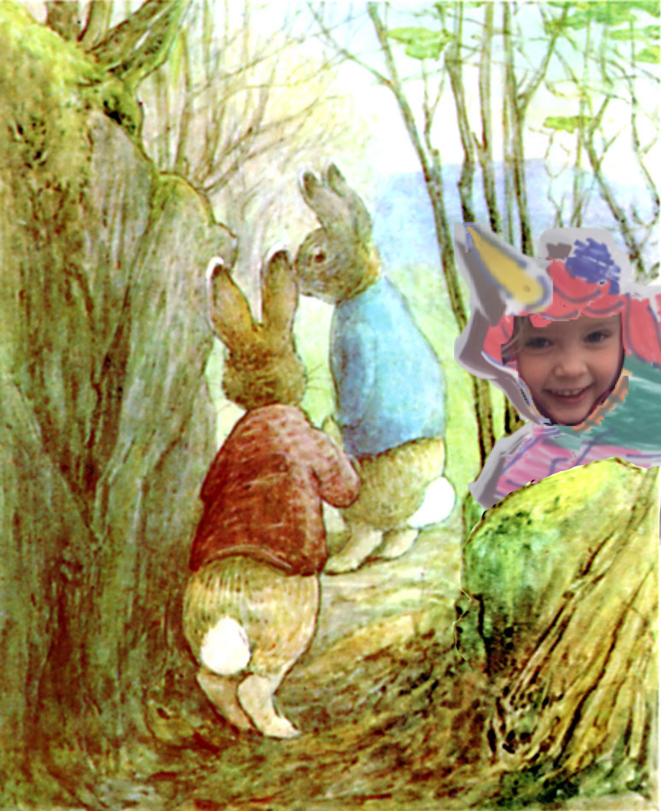

When they came near the wood at the top of Bull Banks, they went cautiously. The trees grew amongst heaped up rocks; and there, beneath a crag—Herr Havre Rev had made one of his homes. It was at the top of a steep bank; the rocks and bushes overhung it. The rabbits crept up carefully, listening and peeping.

<iframe src="https://docs.google.com/forms/d/e/1FAIpQLSdaU1qxlU76iRXUClnxtVycECOt0wqjnCQ8tT6mIzPJxbwDUg/viewform?embedded=true" width="640" height="330" frameborder="0" marginheight="0" marginwidth="0">Loading...</iframe>
