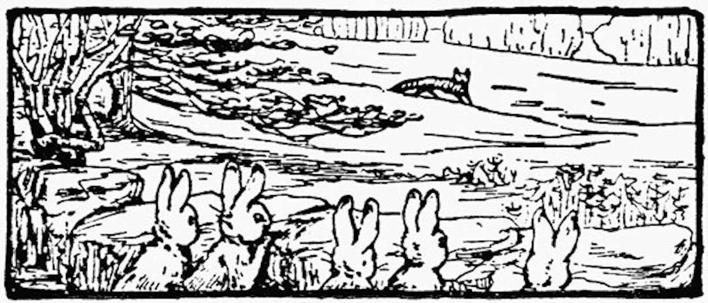
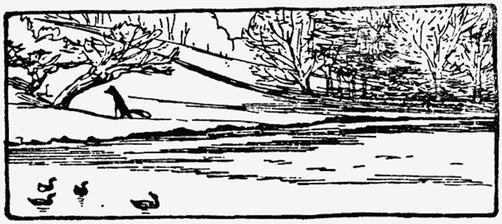

Kaninene kan lukte revelukta til reven på lang vei. Kaninene lukter reven like langt unna som fra huset til Lillian Raae-Vea (4) og ned til Frisk Bris barnehagen i Sofienbergparken.

Selvom kaninene kan lukte revelukta på lang vei kan kaninene likevel aldri helt hvite HVOR reven er. Herr Havre Rev har en uheldig uvane med å vandre rundt. Den ene dagen bor reven i pinneHaugHuset sitt og det er ekstra skummelt for familien til Oban Van Kanini som bor like ved.

Neste dag flytter Herr Havre Rev inn i huset sitt ved Vesletjern og der skremmer han de ville endene og de "usynlige" vannrottene.

Kaninene øver og øver på å samarbeide om å følge med på reven fra de er små kaninunger. Fordi ingen vil bli spist og ingen vil at vennene skal bli spist.

"En dag må vi nok få med noen av de andre dyra i LilloSkogen på å samarbeide MED oss kaniner MOT reven." Sier Petra Kanini.

"Ha-ha-ha! DET tror jeg på når jeg får se det." Svarer broren Oban.

<iframe src="https://docs.google.com/forms/d/e/1FAIpQLSdaU1qxlU76iRXUClnxtVycECOt0wqjnCQ8tT6mIzPJxbwDUg/viewform?embedded=true" width="640" height="333" frameborder="0" marginheight="0" marginwidth="0">Loading...</iframe>

<!--

##Her er dine tegninger:

##Tusen takk
for at du var dugnadsdeltager og lastet opp en tegning til vår felles [Gatsby barnebokbutikk](https://www.gatsbyjs.org/tutorial/).

Hilsen Lillian 🦄 og Ola 😺 i laboraturiet i det bittelille Hvite Hus på Rodeløkka, Oslo, Norway, Earth, next to Venus.

Last opp en tegning til, men husk at Lillian 🦄 og Ola 😺 må lime inn tegningen din før den blir synlig på internett.

<iframe src="https://docs.google.com/forms/d/e/1FAIpQLSdaU1qxlU76iRXUClnxtVycECOt0wqjnCQ8tT6mIzPJxbwDUg/viewform?embedded=true" width="640" height="668" frameborder="0" marginheight="0" marginwidth="0">Loading...</iframe>
-->
Les om lover og regler og copyright
på [about siden](/about/)

<!--
I have made many books about well-behaved people. Now, for a change, I am going to make a story about two disagreeable people, called Geir Grevling and Herr Havre Rev.

Nobody could call Herr Havre Rev "nice." The rabbits could not bear him; they could smell him half a mile off. He was of a wandering habit and he had foxey whiskers; they never knew where he would be next.

One day he was living in a stick-house in the coppice, causing terror to the family of gamle bestefar Benjamin Bouncer. -->
