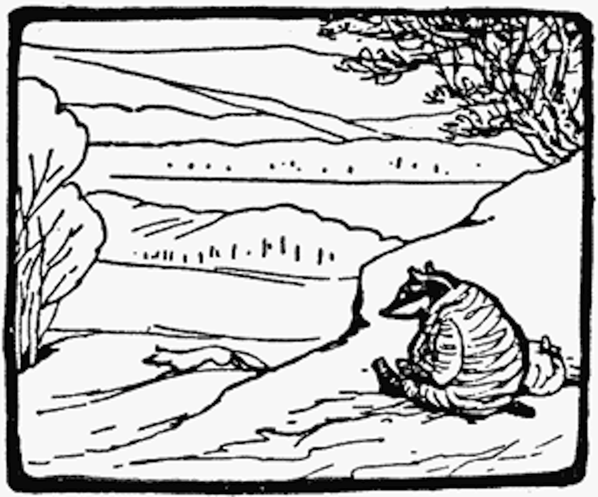

På vintern og tidlig vår kan reven bli sett mellom jord og steiner nær huset sitt under Hodeskallestupet på toppen av Oksehodeåsen. Herr Havre Rev eier like mange hus som et barn har fingre på en hånd, men reven er sjelden hjemme. Husene er IKKE alltid tomme selvom Herr Rev flytter ut fordi noen ganger flytter Geir Grevling inn. Uten å spørre reven om lov! Uhøflig!

Geir Grevling har skitne klær. Han sover på dagen og han legger seg alltid i senga med støvlene på og den senga han legger seg i er nesten alltid Herr Havre Rev sin seng.

<iframe src="https://docs.google.com/forms/d/e/1FAIpQLSdaU1qxlU76iRXUClnxtVycECOt0wqjnCQ8tT6mIzPJxbwDUg/viewform?embedded=true" width="640" height="333" frameborder="0" marginheight="0" marginwidth="0">Loading...</iframe>

<!-- ##Her er dine tegninger:

##Tusen takk
for at du var dugnadsdeltager og lastet opp en tegning til vår felles [Gatsby barnebokbutikk](https://www.gatsbyjs.org/tutorial/).

Hilsen Lillian 🦄 og Ola 😺 i laboraturiet i det bittelille Hvite Hus på Rodeløkka, Oslo, Norway, Earth, next to Venus.

Last opp en tegning til, men husk at Lillian 🦄 og Ola 😺 må lime inn tegningen din før den blir synlig på internett.

<iframe src="https://docs.google.com/forms/d/e/1FAIpQLSdaU1qxlU76iRXUClnxtVycECOt0wqjnCQ8tT6mIzPJxbwDUg/viewform?embedded=true" width="640" height="668" frameborder="0" marginheight="0" marginwidth="0">Loading...</iframe>
-->
Les om lover og regler og copyright
på [about siden](/about/)

<!--
Next day the fox moved into a pollard willow near the lake, frightening the wild ducks and the water rats.

In winter and early spring he might generally be found in an earth amongst the rocks at the top of Okseåsen, under Havregrøtstupet. -->