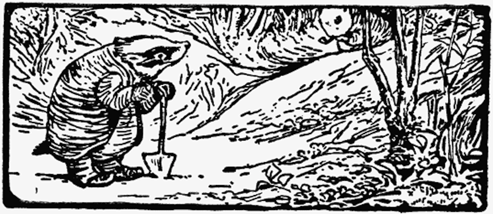

Geir Grevling er kompis med gamle bestefar Benjamini Kanini og de to er enig i at de IKKE liker de onde oterne og at de IKKE liker Herr Havre Rev. Og det snakker de ofte om.

Geir Grevling er en kort, bustete, tjukk, vaggende person med et breialt glis fullt av gule, skarpe tenner. Noen ganger gliser Geir med hele hodet sitt. Geir Grevling har IKKE høflige vaner, han spiser vepsebol og frosker og larver. Om natten vagger Geir Grevling rundt i månelyset og graver opp ting og spiser opp tingene han graver opp. Gamle bestefar Benjamini Kanini er gammel. Bestefar Benjamini sitter i vårsola utenfor døra til kaninhullet med en tjukk frakk og røyker kanintobakk i Calabash pipa si.

<iframe src="https://docs.google.com/forms/d/e/1FAIpQLSdaU1qxlU76iRXUClnxtVycECOt0wqjnCQ8tT6mIzPJxbwDUg/viewform?embedded=true" width="640" height="333" frameborder="0" marginheight="0" marginwidth="0">Loading...</iframe>

<!-- ##Her er dine tegninger:

##Tusen takk
for at du var dugnadsdeltager og lastet opp en tegning til vår felles [Gatsby barnebokbutikk](https://www.gatsbyjs.org/tutorial/).

Hilsen Lillian 🦄 og Ola 😺 i laboraturiet i det bittelille Hvite Hus på Rodeløkka, Oslo, Norway, Earth, next to Venus.

Last opp en tegning til, men husk at Lillian 🦄 og Ola 😺 må lime inn tegningen din før den blir synlig på internett.

<iframe src="https://docs.google.com/forms/d/e/1FAIpQLSdaU1qxlU76iRXUClnxtVycECOt0wqjnCQ8tT6mIzPJxbwDUg/viewform?embedded=true" width="640" height="668" frameborder="0" marginheight="0" marginwidth="0">Loading...</iframe>
-->
Les om lover og regler og copyright
på [about siden](/about/)

<!--
Herr Rev hadde et halvt dusin hus (6), men han var sjelden hjemme.

The houses were not always empty when Mr. Tod moved out; because sometimes Tommy Brock moved in; (without asking leave).

Geir "Gliser'n" Grevling was a short bristly fat waddling person with a grin; he grinned all over his face. He was not nice in his habits. He ate wasp nests and frogs and worms; and he waddled about by moonlight, digging things up. -->