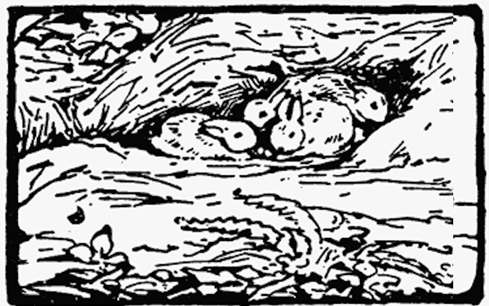
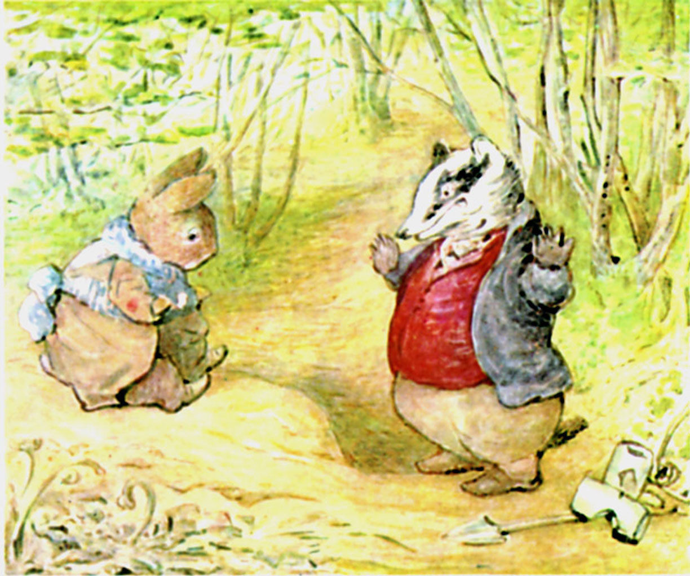

<!--  -->

Gamle bestefar Benjamini Kanini sitter i sola og snakker med Geir Grevling. Geir har med seg en liten sekk og en liten spade som han bruker til å grave opp ting han kan spise. Og Geir har med noen mulvarpfeller. Geir Grevling klager bittert over hvor få fugleegg han har funnet i det siste.

"Reven har stjålet alle fugleeggene fra meg og de onde oterne har spist opp alle froskene mens jeg sov i vinter. Jeg har ikke spist ETT solid måltid på 14 dager. 1-2-3-4-5-6-7-8-9-10-11-12-13-14 dager. Jeg lever av jordnøtter. Jeg må vel snart bli vegetarianer, eller spise min egen hale." Sa Geir Grevling.

Det var IKKE så veldig morsom vits å fortelle, men Gamle bestefar Benjamini Kanini ler så tårene triller likevel fordi grevlingen ser så rar og tjukk og glisete ut. Bestefar Benjamini Kanini ler og ler og insisterer på at Geir Grevling MÅ komme inn en tur.

"Du MÅ komme inn og få et stort stykke av sjokoladekaka som mammakanin Flopsy har bakt og et par glass av min sønn Obans Portvin. Portvinen har et elegant anslag av tørket frukt."

Geir Grevling må MOSE seg inn gjennom døra til kaninhullet fordi døra er så trang og Geir er så tjukk. Og selvom Geir bråker litt så sover kaninbabisene søtt videre i kaninbabysenga si.

<iframe src="https://docs.google.com/forms/d/e/1FAIpQLSdaU1qxlU76iRXUClnxtVycECOt0wqjnCQ8tT6mIzPJxbwDUg/viewform?embedded=true" width="640" height="333" frameborder="0" marginheight="0" marginwidth="0">Loading...</iframe>

<!-- ##Her er dine tegninger:

##Tusen takk
for at du var dugnadsdeltager og lastet opp en tegning til vår felles [Gatsby barnebokbutikk](https://www.gatsbyjs.org/tutorial/).

Hilsen Lillian 🦄 og Ola 😺 i laboraturiet i det bittelille Hvite Hus på Rodeløkka, Oslo, Norway, Earth, next to Venus.

Last opp en tegning til, men husk at Lillian 🦄 og Ola 😺 må lime inn tegningen din før den blir synlig på internett.

<iframe src="https://docs.google.com/forms/d/e/1FAIpQLSdaU1qxlU76iRXUClnxtVycECOt0wqjnCQ8tT6mIzPJxbwDUg/viewform?embedded=true" width="640" height="668" frameborder="0" marginheight="0" marginwidth="0">Loading...</iframe>
-->
Les om lover og regler og copyright
på [about siden](/about/)

<!--
The little rabbit-babies were just old enough to open their blue eyes and kick. They lay in a fluffy bed of rabbit wool and hay, in a shallow burrow, separate from the main rabbit hole. To tell the truth— gamle bestefar Benjamin Bouncer hadde glemt kaninbabiene helt bort. -->
